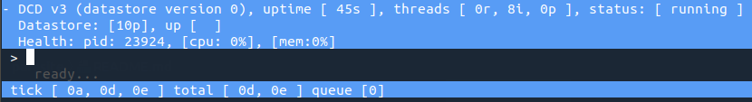
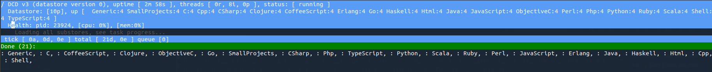

# Introduction

This is the artifact for the paper *CodeDJ: Reproducible Queries over Large-Scale Software Repositories* submitted to ECOOP 2021. The artifact consists of three parts:
- **Getting started** A walkthrough through the setting up the system from scratch and executing queries;
- **Query submission** A presentation of our mechanism query submission scheme; and
- **Experiment** A re-creation of the experiment from the paper.

## Paper details

**CodeDJ: Reproducible Queries over Large-Scale Software Repositories**

Petr Maj. CTU Prague.  
Konrad Siek. CTU Prague.  
Alexander Kovalenko. CTU Prague.   
Jan Vitek. CTU Prague and Northeastern.  

**Abstract** Analyzing massive code bases is a staple of modern software
engineering research – a welcome side-effect of the advent of large-scale
software repositories such as GitHub. Selecting projects to analyze is a
labor-intensive process that can lead to biased results if the chosen projects
are not representative. One issue is that the interface exposed by software
repositories only allows formulation of the most basic of queries. Code DJ is an
infrastructure for querying repositories composed of a persistent datastore,
constantly updated with data acquired GitHub, and an in-memory database with a
Rust query interface. Code DJ supports reproducibility, historical queries are
answered deterministically using historical states of the datastore; thus
researchers can reproduce published results. To illustrate the benefits of Code
DJ , we identify biases in the data of a published study and, by repeating the
analysis with new data, we demonstrate that its conclusions were sensitive to
the choice of projects.

## Part 1: Getting started

This part describes setting up the CodeDJ system from scratch, downloading a dataset, and running a query.

Prerequisites:

- [git](https://git-scm.com/), 
- [Rust and cargo](https://www.rust-lang.org/tools/install), 
- TODO libs.

In order to download projects from GitHub Parasite requires the user have a GitHub account and a personal access token. You can generate a token for your GitHub account by following the instructions [here](https://docs.github.com/en/github/authenticating-to-github/creating-a-personal-access-token). The token does not need any scopes or permissions.

### Setup

Downloading and building Parasite (the GitHub dataset downloader):

```bash
git clone https://github.com/PRL-PRG/codedj-parasite.git parasite
cd parasite
cargo build --release
cd ..
```

Downloading and building Djanco (the query engine):

```bash
git clone https://github.com/PRL-PRG/djanco.git 
cd djanco 
cargo build --release
cd ..
```

### Downloading a toy dataset

We explain how to download a small 10-project dataset using Parasite. We also provide a pre-downloaded repository in `pregenerated/toy-dataset` so this step can be skipped.

To create a basic dataset, first create a directory that will contain the downloaded. Be aware that datasets tend to be large. 

```bash
mkdir -p toy-dataset/
```

Next, specify the list of repositories to include in the dataset in a CSV file. The toy dataset will contain the following 10 repositories (4 Python, 4 JavaScript, and 2 TypeScript repositories):

```
repository
https://github.com/nodejs/node.git
https://github.com/pixijs/pixi.js.git
https://github.com/angular/angular.git
https://github.com/apache/airflow.git
https://github.com/facebook/react.git
https://github.com/vuejs/vue.git
https://github.com/xonsh/xonsh.git
https://github.com/meteor/meteor.git
https://github.com/3b1b/manim.git
https://github.com/s0md3v/photon.git
```

This file is located at `toy-dataset-repositories.csv`.

Then, feed the list of repositories to Parasite:

```
parasite/target/release/parasite --datastore toy-dataset add toy-dataset-repositories.csv
```

Next, create a CSV file containing one of more [GitHub personal access tokens](https://docs.github.com/en/github/authenticating-to-github/creating-a-personal-access-token). No special scopes or permissions are needed on the token. These are used to download data using the GitHub REST API and are essential for the downloader to work.

```
token
fa56454....
```

We cannot provide a file with these for presentation purposes. We assume the reader prepares their own token file in the current directory at `ghtokens.csv`.

The next step is to enter interactive console in Parasite. Provide a path to the GitHub token file via the ght flag. You can also specify the number of threads that the downloader will use with the n flag (here we use 8).

```bash
parasite --datastore toy-dataset -ght ghtokens.csv -n 8 --interactive
```



In interactive console: execute the loadall command to load substore information into memory.

```
> loadall
```



Then, also in *interactive* console: execute `updateall` to start the
downloader. This will cause Parasite to download, process and store information
about each added repository using 8 threads.

```
 > updateall
 ```

Wait until the download completes (about 15 minutes for the example dataset).
Exit the downloader (`^C`). The example dataset is ready for querying. 

### Setting up a query

There are two ways in which a query can be written and executed. We prepared a system that will generate a cargo crate and then generate a run script for all the queries in the crate. This is the easiest way to use Djanco. Alternatively, one can create a cargo crate from scratch. We only present the former here.

A pre-generated instance of the crate generated by this process is included in `pregenerated/my-query-crate`.

First, install the `generate` command for the `cargo` system.

```bash
cargo install cargo-generate
```


Then, install the `djanco` command for the `cargo` system.

```bash
cargo install --git https://github.com/PRL-PRG/cargo-djanco
```

Generate a cargo crate:

```bash
cargo generate --git https://github.com/PRL-PRG/djanco-query-template --name my-query-crate
cd my-query-crate
```

This creates a fully-configured cargo create at location`my-query-crate` with the following directory structure:

```
my-query-crate/
├── Cargo.toml
├── README.md
└── src
    └── lib.rs
```

Inside the crate, there is a `lib.rs` file with an example query that selects the top starred project in each language using all available subsets of the repository.

```rust
use std::path::Path;

use djanco::*;
use djanco::data::*;
use djanco::log::*;
use djanco::csv::*;

use djanco_ext::*;

#[djanco(May, 2021, subsets(All))]
pub fn my_query(database: &Database, _log: &Log, output: &Path) -> Result<(), std::io::Error>  {
    database.projects()
        .group_by(project::Language)
        .sort_by(project::Stars)
        .sample(Top(1))
        .into_csv_in_dir(output, "top_1_project_by_stars_in_each_language.csv")
}
```

Generate a run script for the queries:

```
cargo djanco
```

This generates a rust program at location `src/bin/djanco.rs` that initializes the dataset and runs all functions in the crate that are tagged as `#[djanco(...)]`.

### Running the query

Build and execute the query using the toy dataset:

```bash
cargo run --release --bin djanco -- --dataset-path ../toy-dataset --cache-path cache --output-path output
```

After the query is executed, the results of the query will be available at `output/top_1_project_by_stars_in_each_language.csv` [truncated]:

```
language,project_id,substore,url, [...] ,stars, ...
JavaScript,5,JavaScript,https://github.com/vuejs/vue.git, [...] ,181894, ...
TypeScript,2,TypeScript,https://github.com/angular/angular.git, [...] ,72384, [...]
Python,8,Python,https://github.com/3b1b/manim.git, [...] ,32791, [...]
```

We attach a pregenerated instance of the output of this query at `pregenerated/top_1_project_by_stars_in_each_language.csv`. Note that the values of attributes will have changed over time and the downloader will acquire the most recent values---preserving historical data requires updating a dataset over time.

```
cd ..
```

## Part 2: Query submission


## Part 3: Experiment


